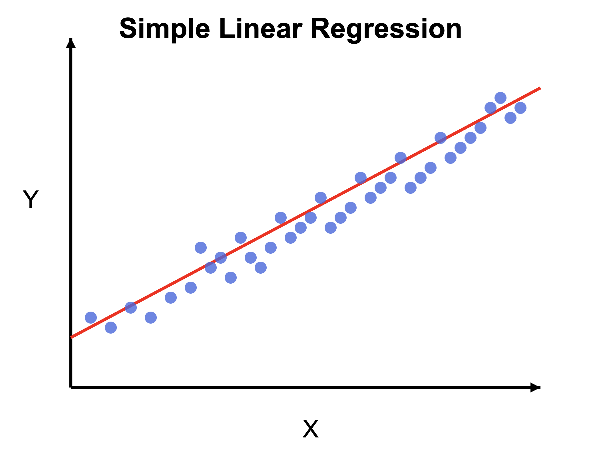
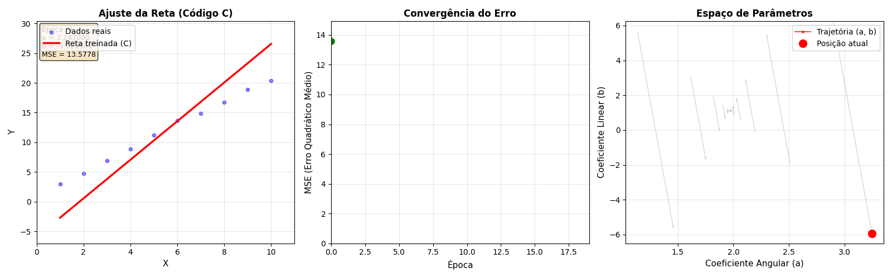

# 📈 Regressão Linear com Descida de Gradiente


> Implementação completa de regressão linear usando o algoritmo de **Descida de Gradiente** (Gradient Descent) em C e Python, com visualização interativa do processo de treinamento.

## 👥 Autores

- **Raquel Maciel**
[](https://github.com/raquelmcoelho)
- **Ulisses Bonfim**
[](https://github.com/ulissesbon)

---

## 📚 O que é Regressão Linear?

Regressão Linear é um método estatístico usado para modelar a relação entre uma variável dependente (y) e uma ou mais variáveis independentes (x). No caso mais simples (regressão linear simples), buscamos encontrar a melhor reta que se ajusta aos dados.

### 📐 Equação da Reta

```
y = a*x + b
```

Onde:
- **a** (coeficiente angular): inclinação da reta
- **b** (coeficiente linear): intercepto (valor de y quando x = 0)

### 🎯 Objetivo

Encontrar os valores de **a** e **b** que **minimizam o erro** entre os valores preditos pela reta e os valores reais dos dados.


*Figura 1: Conceito de regressão linear - ajustar uma reta aos dados*

---

## 🧮 Descida de Gradiente

A **Descida de Gradiente** (Gradient Descent) é um algoritmo iterativo de otimização que ajusta os parâmetros gradualmente:

### 📊 Algoritmo

1. **Inicializar** parâmetros (a = 0, b = média de y)
2. **Calcular predições**: y_pred = a*x + b
3. **Calcular erro**: MSE = (1/N) * Σ(y_pred - y_real)²
4. **Calcular gradientes**:
   - ∂MSE/∂a = (2/N) * Σ(erro * x)
   - ∂MSE/∂b = (2/N) * Σ(erro)
5. **Atualizar parâmetros**:
   - a ← a - taxa_aprendizado * ∂MSE/∂a
   - b ← b - taxa_aprendizado * ∂MSE/∂b
6. **Repetir** passos 2-5 por N épocas

### 🎬 Visualização do Treinamento


*Figura 2: Visualização do processo de treinamento mostrando o ajuste da reta, evolução do erro e trajetória no espaço de parâmetros*

---

## 🏗️ Estrutura do Projeto

```
.
├── data/                          # Datasets gerados
│   ├── dataset0.csv              # Dataset 1 (a=2, b=1)
│   ├── dataset1.csv              # Dataset 2 (a=60, b=70)
│   ├── dataset2.csv              # Dataset 3 (a=100, b=1000)
│   └── dataset3.csv              # Dataset 4 (a=300, b=0)
│
├── docs/                          # Documentação e imagens
│   └── images/
│       └── regressao_linear_conceito.png
│
├── generate_data.py              # Gerador de datasets sintéticos
├── main.c                        # Implementação em C
├── main.py                       # Implementação em Python (sklearn)
├── view.py                       # Visualizador interativo
│
├── historico_treinamento.csv    # Histórico exportado pelo C
├── animacao_treinamento.gif     # Animação gerada pelo view.py
│
└── README.md                     # Este arquivo
```

---

## 📥 Formato de Entrada

Os datasets são arquivos CSV com duas colunas:

```csv
x,y
1.0,3.2
2.0,5.1
3.0,7.0
4.0,8.9
...
```

Onde:
- **x**: variável independente (feature)
- **y**: variável dependente (target)

---

## 📤 Formato de Saída

### Saída no Terminal (C)

```
=======================================================================
  REGRESSÃO LINEAR COM DESCIDA DE GRADIENTE EM C
=======================================================================
  Autores: Raquel Maciel e Ulisses Bonfim
=======================================================================

📁 Dataset 0: data/dataset0.csv
-----------------------------------------------------------------------
  ✅ Carregado: 1000 amostras

  📊 Estatísticas dos dados:
     • Média de X: 500.500000
     • Média de Y: 1002.000000

  🔄 Treinando modelo (30000 épocas)...
     Época      1/30000 - MSE: 334334.123456 - a: 0.020000, b: 1002.000000
     Época   5001/30000 - MSE: 126.456789 - a: 1.980000, b: 3.456789
     ...
     Época  30000/30000 - MSE: 0.125678 - a: 2.000123, b: 0.998765

  💾 Histórico salvo em: historico_treinamento.csv

  ✨ RESULTADOS FINAIS:
     • Equação da reta: y = 2.000123 * x + 0.998765
     • Coeficiente angular (a): 2.000123
     • Coeficiente linear (b):  0.998765

=======================================================================
```

### Arquivo de Histórico (CSV)

```csv
epoca,a,b,mse
0,0.0000000000,1002.0000000000,334334.1234567890
1,0.0200000000,1001.9800000000,334120.5678901234
2,0.0399800000,1001.9600200000,333907.0123456789
...
29999,2.0001234567,0.9987654321,0.1256789012
```

Colunas:
- **epoca**: número da iteração
- **a**: coeficiente angular na época
- **b**: coeficiente linear na época  
- **mse**: erro quadrático médio na época

---

## 🚀 Como Usar

### 1️⃣ Gerar Datasets

```bash
python generate_data.py
```

Isso criará 4 datasets em `data/` com diferentes parâmetros de ruído e inclinação.

### 2️⃣ Treinar Modelo em C

```bash
# Compilar
gcc -o main main.c -lm

# Executar
./main
```

O programa irá:
- Carregar os datasets
- Treinar o modelo usando descida de gradiente
- Salvar o histórico em `historico_treinamento.csv`
- Exibir os parâmetros finais

### 3️⃣ Treinar Modelo em Python (Comparação)

```bash
python main.py
```

Use para comparar os resultados com a implementação em scikit-learn.

### 4️⃣ Visualizar Treinamento

```bash
python view.py
```

Isso irá:
- Carregar o histórico gerado pelo C
- Criar visualização interativa com 3 gráficos
- Salvar animação em `animacao_treinamento.gif`
- Exibir janela com a animação

---

## 📊 Visualizações

O `view.py` gera três visualizações simultâneas:

### 1. Ajuste da Reta
Mostra como a reta se ajusta aos dados ao longo das épocas.

### 2. Evolução do Erro (MSE)
Gráfico mostrando a redução do erro ao longo do treinamento.

### 3. Espaço de Parâmetros
Trajetória dos parâmetros (a, b) durante a otimização, com campo de gradiente.

---

## ⚙️ Configurações

### Em C (`main.c`)

```c
#define QUANTIDADE_ARQUIVOS 1        // Número de datasets
#define QUANTIDADE_AMOSTRAS 1000     // Amostras por dataset
#define EPOCAS_TREINAMENTO  30000    // Iterações de treinamento
#define TAXA_APRENDIZADO_INCLINACAO  1e-5  // Learning rate para a
#define TAXA_APRENDIZADO_INTERCEPTO  1e-5  // Learning rate para b
```

### Em Python (`generate_data.py`)

```python
QUANTIDADE_ARQUIVOS = 4
QUANTIDADE_AMOSTRAS = 1000
COEFICIENTES_ANGULARES = [2, 60, 100, 300]
COEFICIENTES_LINEARES = [1, 70, 1000, 0]
PROPORCAO_RUIDO = 0.5
```

---

## 📦 Dependências

### Python

```bash
pip install numpy matplotlib scikit-learn pillow
```

- **numpy**: operações numéricas
- **matplotlib**: visualizações e animações
- **scikit-learn**: comparação com SGDRegressor
- **pillow**: salvar animação como GIF

### C

- **GCC** ou outro compilador C
- Biblioteca matemática padrão (`-lm`)

---

## 🎓 Conceitos Implementados

- ✅ Regressão Linear Simples
- ✅ Descida de Gradiente (Gradient Descent)
- ✅ Centralização de Dados (Data Centering)
- ✅ Função de Custo: MSE (Mean Squared Error)
- ✅ Taxa de Aprendizado (Learning Rate)
- ✅ Exportação de Histórico de Treinamento
- ✅ Visualização Interativa
- ✅ Comparação entre Implementações (C vs Python)

---

## 🔬 Técnicas Utilizadas

### Centralização de X

```
x_centralizado = x - média(x)
```

**Por quê?** Desacopla os parâmetros a e b, melhorando a convergência.

### Inicialização Inteligente

```c
a_inicial = 0.0
b_inicial = média(y)
```

**Por quê?** Começa próximo da solução, acelerando o treinamento.

### Conversão de Escala

Após treinar no espaço centralizado, convertemos de volta:

```
a_original = a_centralizado
b_original = b_centralizado - a_centralizado * média(x)
```

---

## 📈 Resultados Esperados

Para o dataset com **a = 2** e **b = 1**:

| Métrica | Valor Esperado | Típico após 30k épocas |
|---------|---------------|------------------------|
| a (inclinação) | 2.0 | 1.998 - 2.002 |
| b (intercepto) | 1.0 | 0.998 - 1.002 |
| MSE final | ~0 | 0.1 - 0.5 |

---

## 🐛 Troubleshooting

### Problema: "Erro ao abrir arquivo CSV"
**Solução**: Certifique-se de que a pasta `data/` existe e execute `generate_data.py` primeiro.

### Problema: "MSE não converge"
**Solução**: Reduza a taxa de aprendizado ou aumente o número de épocas.

### Problema: "GIF não é salvo"
**Solução**: Instale pillow: `pip install pillow`

### Problema: "Valores oscilam muito"
**Solução**: Use taxas de aprendizado menores (ex: 1e-6 ou 1e-7).

---

## 📖 Referências

- [Gradient Descent - Wikipedia](https://en.wikipedia.org/wiki/Gradient_descent)
- [Linear Regression - Scikit-learn](https://scikit-learn.org/stable/modules/linear_model.html)
- [An Introduction to Gradient Descent](https://developers.google.com/machine-learning/crash-course/reducing-loss/gradient-descent)

---

## 📝 Licença

Este projeto está sob a licença MIT. Sinta-se livre para usar, modificar e distribuir.

---

## 🤝 Contribuições

Contribuições são bem-vindas! Sinta-se à vontade para:
- Reportar bugs
- Sugerir melhorias
- Adicionar novas funcionalidades
- Melhorar a documentação

---

## 📧 Contato

Para dúvidas ou sugestões, entre em contato com os autores:
- **Raquel Maciel**
- **Ulisses Bonfim**

---

<div align="center">

**Desenvolvido com ❤️ usando C e Python**

⭐ Se este projeto foi útil, considere dar uma estrela!

</div>